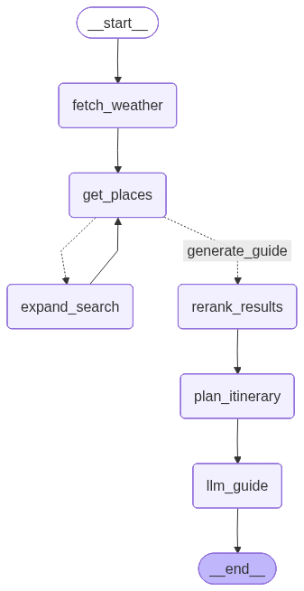

# WanderWise AI 🌍🧠

> **An Intelligent Agentic Orchestrator for High-Precision Travel Itinerary Synthesis**

WanderWise is a Agentic AI system built with **LangGraph** and **Gemini 2.5 Flash**. It moves beyond standard RAG by implementing a **Quality-First Deterministic Loop**—prioritizing high-vibe relevance over raw data quantity.

## Technical Architecture

The system is designed as a **Stateful Directed Acyclic Graph (DAG)** with recursive recovery loops. It follows a multi-stage cognitive process:

1.  **Environmental Awareness:** Fetches real-time weather (OpenWeatherMap) to contextualize the "Vibe" (e.g., suggesting indoor spots if it's 35°C+).
2.  **Autonomous Discovery:** Queries Geoapify APIs using a dynamic radius-expansion strategy.
3.  **Intelligent Re-Ranking:** A dedicated LLM node evaluates raw POI data against the user's "Vibe" (Nature, Spiritual, etc.), scoring results and filtering for 8+ "High-Match" candidates.
4.  **Efficiency Router:** Implements a "Satisficing" logic—if 5+ high-quality matches are found, it breaks the loop early to save latency/tokens. Otherwise, it expands the radius (+5km) and retries.
5.  **Structured Synthesis:** Organizes validated points into a logical Morning/Afternoon/Evening flow, ensuring 0% hallucination of non-existent venues.

### System Flow

## Tech Stack

- **Orchestration:** LangGraph (StateGraph)
- **Intelligence:** Google Gemini 2.5 Flash
- **Geospatial Data:** Geoapify Places API
- **Climate Data:** OpenWeatherMap API
- **Data Integrity:** Pydantic (AgentState)
- **Memory:** `MemorySaver` (Checkpointing for multi-turn threads)

## Key Breakthroughs

- **Quality-Centric Routing:** Optimized the search loop to prioritize "High-Vibe" matches over count, reducing unnecessary API calls in dense urban areas (e.g., Bengaluru).
- **The "Dead Zone" Protocol:** Short-circuit logic that provides a graceful, data-driven response when zero physical locations match the criteria, rather than allowing the LLM to invent spots.
- **Context-Aware Reranking:** Uses Gemini to perform semantic filtering on raw JSON data, bridging the gap between rigid API categories and subjective user "Vibes."
