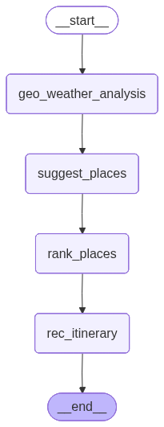

# WanderWise AI 🌍🧠

> **An Adaptive Agentic Orchestrator for High-Precision Travel Itinerary Synthesis**

WanderWise is a Agentic AI system built with **LangGraph**, **Gemini 2.5 Flash**, and **Chainlit**. It moves beyond standard RAG by implementing a **Quality-First Deterministic Loop**—prioritizing high-vibe relevance and real-world environmental context over raw data quantity.

---

## Features

* **Interactive Human-in-the-Loop (HITL):** A sophisticated UI flow that prompts users for location permissions or manual entry when destination intent is ambiguous (`DETECT` state).
* **Multi-Provider Geo-Location:** A robust "Fail-Safe" IP-to-Coordinate engine using multiple providers (ip-api, ipapi.co) with automatic connection timeout recovery.
* **Dynamic "Vibe" Control:** Integrated Sidebar settings allowing users to toggle between *Nature, Spiritual, Shopping,* and *Historical* personas in real-time.
* **Stateful Threading:** Leverages `MemorySaver` to maintain context across multi-turn conversations, allowing users to refine itineraries mid-chat using unique session IDs.

---

## Technical Architecture

The system is designed as a **Stateful Directed Graph** with recursive recovery loops, governed by a strict **Pydantic AgentState**.

### The Multi-Stage Cognitive Process:

1.  **Intent Extraction:** A dedicated LLM node parses user queries to detect "Vibe" and "Location" (using a `DETECT` flag for ambiguous inputs).
2.  **Environmental Awareness:** Synchronizes with **OpenWeatherMap** to contextualize suggestions (e.g., prioritizing indoor "Historical" spots if local temperatures exceed 35°C).
3.  **Autonomous Discovery:** Queries the **Geoapify Places API** using a dynamic radius-expansion strategy.
4.  **Intelligent Re-Ranking:** Gemini 2.5 Flash evaluates raw POI JSON against the user’s selected "Vibe," scoring results and filtering for "High-Match" candidates.
5.  **Deterministic Synthesis:** Organizes validated coordinates and metadata into a logical Morning/Afternoon/Evening flow with **0% hallucination** of non-existent venues.

---

### System Flow

---

## Tech Stack

* **Orchestration:** LangGraph (StateGraph)
* **Intelligence:** Google Gemini 2.5 Flash
* **Interface:** Chainlit
* **APIs:** Geoapify Places API, OpenWeatherMap API & IP-API
* **Data Integrity:** Pydantic (Strict Validation)
* **Memory:** `MemorySaver` (Checkpointing)

---

## Key Breakthroughs

* **The "Dead Zone" Protocol:** A short-circuit logic that provides a graceful, data-driven fallback when zero physical locations match the criteria, preventing LLM "hallucination loops."
* **Adaptive UI Logic:** Custom Chainlit `Action` callbacks that manage GPS permissions and automatically clean up the interface (removing buttons after selection) to ensure a clean UX.
* **Context-Aware Reranking:** Bridges the gap between rigid API categories and subjective user "Vibes" by performing semantic filtering on raw geospatial data.

---
